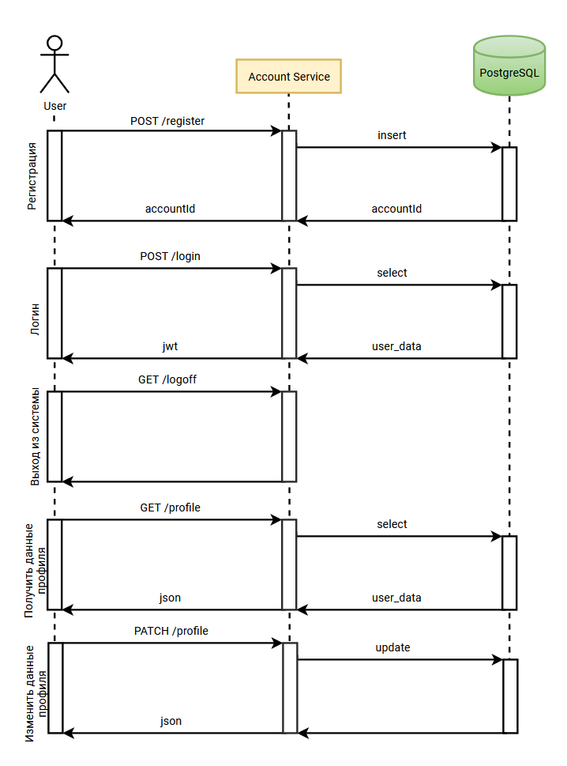
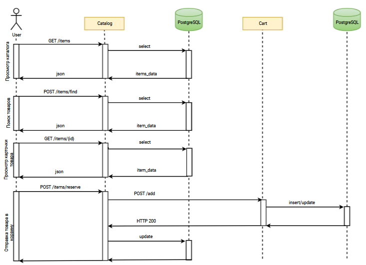
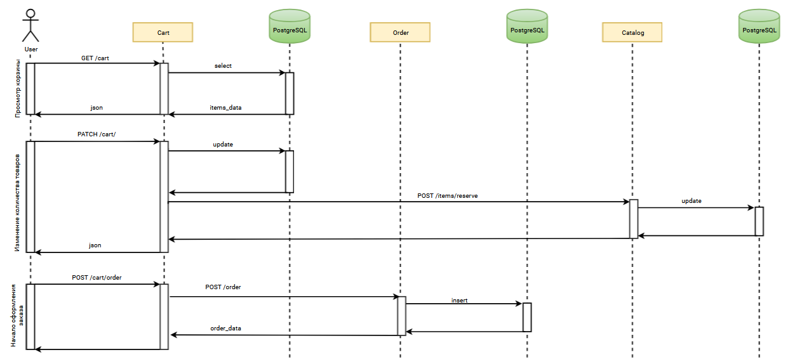
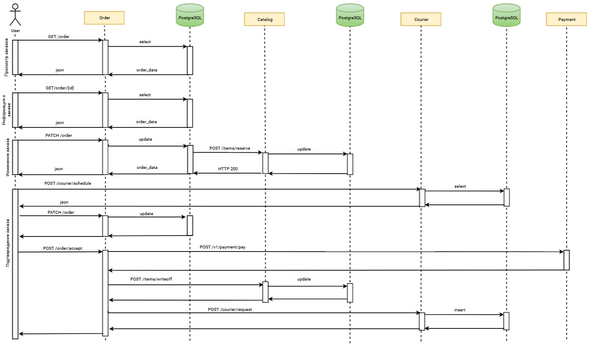

# Домашнее задание 1

## Паттерны декомпозиции микросервисов
### Цель: Разделить приложение на несколько микросервисов с учетом будущих изменений.

### Задача
Необходимо предоставить:

1. Пользовательские сценарии в свободном формате.
2. Общую схему взаимодействия сервисов в свободном формате.
3. Для каждого сервиса опиcать назначение сервиса и его зону ответственности в свободном формате.
4. Описать контракты взаимодействия сервисов друг с другом в свободном формате.

---

## В качестве примера возьмём интернет-магазин

### 1. Для него можно выделить следующие сценарии:

- Пользователь регистрируется в магазине
- Пользователь проходит аутентификацию
- Пользователь осуществляет поиск в каталоге товаров
- Пользователь формирует корзину
     - Добавляет товар
     - Удаляет товар
     - Изменяет количество единиц товара
     - Имеет возможность просмотреть корзину
     - Имеет возможность очистить корзину

- Пользователь оформляет заказ
    - Выбирает адрес доставки
    - Получает данные о времени доставки
    - Выбирает время доставки
    - Подтверждает заказ
- Пользователь оплачивает заказ
- Пользователь может отменить заказ

---
### 2. Схема взаимодействия
**Управление аккаунтом**

**Просмотр товаров и отправка товара в корзину**

**Работа с корзиной и начало оформления заказа**

**Работа с заказами**

---
### 3. Описание сервисов. Назначение и зоны ответственности. Контракты взаимодействия

### Сервисы
- Сервис Управление аккаунтом (Account)
- Сервис Каталог товаров (Catalog)
- Сервис Корзина (Cart)
- Сервис Заказ (Order)
- Сервис Курьерская служба (Courier)
- Сервис Оплата (Payment)
---
### 3.1 Сервис Управление аккаунтами

**Функционал:**
- Создание аккаунта
- Логин
- Логаут
- Чтение атрибутов пользователя
- Редактирование атрибутов пользователя

**Методы API:**

 - **`POST /v1/register`** - Регистрация пользователя в системе. 
    
    **Параметры:** 
    - JSON с данными о пользователе (имя, логин, пароль и т.д.)
 - **`GET /v1/profile/{id}`** - Получение данных о пользователе. 
    
    **Параметры:** 
    - id - идентификатор пользователя. 
    - JWT - передаётся в заголовке "X-Access-Token"
    
    **Возвращаемые значения:**
    - JSON с данными о пользователе

 - **`PATCH /v1/profile/{id}`** - Изменение данных пользователя. 

    **Параметры:** 
    - JSON с изменяемыми данными
    - JWT - передаётся в заголовке "X-Access-Token"

 - **`GET /v1/login`** - Аутентификация пользователя в системе. 
    **Возвращаемые значения:**
    - JWT
 - **`GET /v1/logoff`** - Выход из системы. 
    
---
### 3.2 Сервис Каталог 

**Функционал:**
- Просмотр товаров
- Поиск товаров
- Просмотр подробных сведений о товаре (характеристики, информация о наличии и пр.)
- Отправка товара в корзину (резервирование), снятие резервирования при удалении из корзины
- Списание товара (при завершении заказа)

**Методы API:**

 - **`GET /v1/items/{offset}/{limit}`** - Просмотр перечня товаров. 
 
   **Параметры:**
   
   - offset - 'смещение' начального элемента списка; 
   - limit - требуемое количество товаров
   
   **Возвращаемые значения:** JSON с данными о товарах
   
 - `POST /v1/items/find/{template}` - Поиск товаров 
    
    **Параметры:** 
    - JSON c идентификатором товара и идентификатором пользователя.

     **Возвращаемые значения:** 
     - JSON с данными о товарах
 - `GET /v1/items/{id}` - Получение данных о конкретном товаре. 

   **Параметры:** 
    - id - идентификатор товара

    **Возвращаемые значения:** 
    - JSON с данными о товаре

 - `POST /v1/items/reserve/` - резервирование товара и добавление в корзину. 
    
    **Параметры:** 
    - JSON c идентификатором товара, количеством и идентификатором пользователя.

- `POST /v1/items/writeoff/` - списание товаров при продаже. 
    
    **Параметры:** 
    - JSON c данными по заказу количеством и идентификатором пользователя.
 

---
### 3.3 Сервис Корзина 

**Функционал:**
- Просмотр "отложенных" товаров
- Изменение количества единиц позиции товара
- Начало оформления заказа

**Методы API:**

 - **`GET /v1/cart/{offset}/{limit}`** - Просмотр перечня товаров. 
 
   **Параметры:**
   
   - offset - 'смещение' начального элемента списка; 
   - limit - требуемое количество товаров
   
   **Возвращаемые значения:** 
   - JSON с перечнем товаров
   
 - `PATCH /v1/cart/` - Изменение количества единиц товара 
    
    **Параметры:** 
    - JSON c идентификатором товара, новым ноличеством и идентификатором пользователя.

     **Возвращаемые значения:** JSON с данными о товарах

 - `POST /v1/cart/order/` - Начало оформления заказа. 

---
 
 ### 3.4 Сервис Заказ (Order)

**Функционал:**
- Создание заказа
- Просмотр перечня заказов
- Получение данных о конкретном заказе
- Изменение заказа
- Подтверждение заказа
- Отмена заказа

**Методы API:**

- `POST /v1/order/` - Создание заказа. 
 
  **Параметры:**
    - JSON с данными о товарах 

  **Возвращаемые значения:**
    - id - идентификатор заказа

 - **`GET /v1/order/{offset}/{limit}`** - Просмотр перечня заказов. 
 
   **Параметры:**

   - offset - 'смещение' начального элемента списка; 
   - limit - требуемое количество 'элементов
   
   **Возвращаемые значения:** 
   - JSON с перечнем заказов

 - `GET /v1/order/{id}` - Получение данных о конкретном заказе. 

   **Параметры:** 
    - id - идентификатор заказа

    **Возвращаемые значения:** 
    - JSON с данными о заказе
   
 - `PATCH /v1/order/` - Изменение заказа
    
    **Параметры:** 
    - JSON c новыми позициями заказа.

     **Возвращаемые значения:** 
     - JSON с данными о заказе

 - `POST /v1/order/accept/{id}` - Подтверждение заказа. 
 
  **Параметры:** 
    - id - идентификатор заказа

 - `POST /v1/order/revoke/{id}` - Отмена заказа. 

  **Параметры:** 
    - id - идентификатор заказа

 ---
 
### 3.5 Курьерская служба (Courier)

**Функционал:**
- Получение доступного времени доставки
- Заявка на доставку
- Отмена доставки

**Методы API:**

 - **`POST /v1/courier/schedule`** - Получение доступного времени доставки. 
 
   **Параметры:**

   - JSON с данными о доставке (идентификатор заказа, характеристики груза, адрес доставки, пользователь)
   
   **Возвращаемые значения:** JSON с доступными диапазонами времени доставки

 - **`POST /v1/courier/request`** - Заявка на доставку.  

   **Параметры:** 
    - JSON с данными о доставке (идентификатор заказа, характеристики груза, адрес доставки, пользователь)

    **Возвращаемые значения:** 
    - JSON со статусом заявки
   
- **`POST /v1/courier/revoke`** - Отмена доставки  

   **Параметры:** 
    - id_request - идентификатор заявки

    **Возвращаемые значения:** 
    - JSON со статусом заявки
 

  ---
 
### 3.6 Сервис Оплата (Payment)

**Функционал:**
- Заявка на оплату
- Отмена платежа

**Методы API:**

 - **`POST /v1/payment/pay`** - Заявка на оплату 
 
   **Параметры:**

   - Данные об оплате
   
   **Возвращаемые значения:** 
   - Ствтус оплаты

 - **`POST /v1/payment/revoke`** - Отмена платежа

   **Параметры:** 
    - Данные об оплате

    **Возвращаемые значения:** 
    - Статус оплаты
 