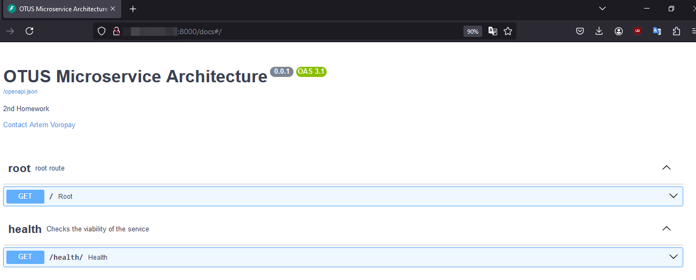
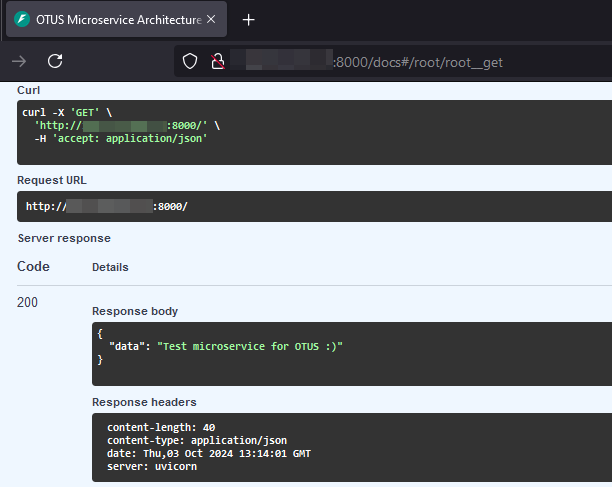
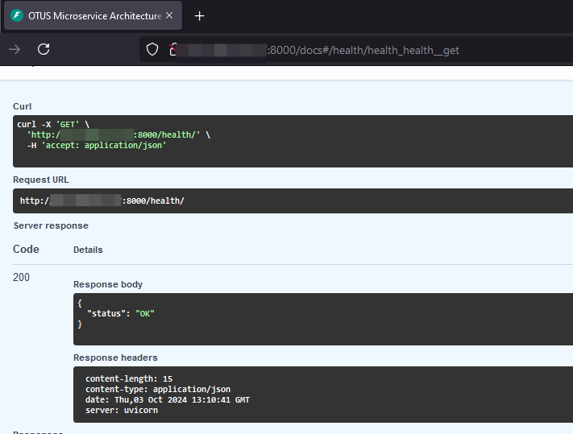
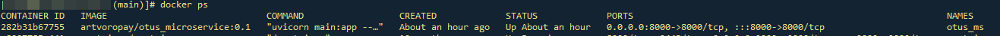

# Домашнее задание 2

## Основы работы с Docker
### Цель: Обернуть приложение в docker-образ и запушить его на Dockerhub.

### Задача
**1. Создать минимальный сервис, который**

- отвечает на порту 8000
- имеет http-метод:

   **`GET /health/
    RESPONSE: {"status": "OK"}`**

**2. Cобрать локально образ приложения в докер контенер под архитектуру AMD64.**

- Запушить образ в dockerhub

- На выходе необходимо предоставить

    - имя репозитория и тэг на Dockerhub
    - ссылку на github c Dockerfile, либо приложить Dockerfile в ДЗ

---

## Для реализации используется FastAPI и ASGI uvicorn


## Результат проверки метода



---

## Dockerfile
```FROM python:3.9.20-slim-bullseye
RUN mkdir /app
COPY ./main.py /app
WORKDIR /app/
COPY requirements.txt /app/requirements.txt
RUN pip install -r requirements.txt
EXPOSE 8000
CMD ["uvicorn", "main:app", "--host", "0.0.0.0"]
```

---
## Скачивание образа:
### **`docker pull artvoropay/otus_microservice:0.1`**

## Запуск контейнера:
### **`docker run --name otus_ms -d -p 8000:8000 --restart=unless-stopped artvoropay/otus_microservice:0.1`**

### Запущенный контейнер можем увидеть с помощью команды `docker ps`

