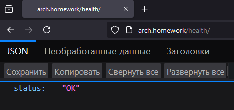

# Домашнее задание 3

## Основы работы с Kubernetes
### Цель: В этом ДЗ вы научитесь создавать минимальный сервис. 

### Задача
**1. Создать минимальный сервис, который**

- отвечает на порту 8000
- имеет http-метод:

   **`GET /health/
    RESPONSE: {"status": "OK"}`**

**2. Cобрать локально образ приложения в докер контенер под архитектуру AMD64.**

- Запушить образ в dockerhub

- На выходе необходимо предоставить

    - имя репозитория и тэг на Dockerhub
    - ссылку на github c Dockerfile, либо приложить Dockerfile в ДЗ

**3. Написать манифесты для деплоя в k8s для этого сервиса.**

- Манифесты должны описывать сущности: Deployment, Service, Ingress.
- В Deployment могут быть указаны Liveness, Readiness пробы.
- Количество реплик должно быть не меньше 2. 
- Image контейнера должен быть указан с Dockerhub.
- Хост в ингрессе должен быть arch.homework. В итоге после применения манифестов GET запрос на http://arch.homework/health должен отдавать {“status”: “OK”}.

**4. На выходе предоставить**

- ссылку на github c манифестами. Манифесты должны лежать в одной директории, так чтобы можно было их все применить одной командой kubectl apply -f .
- url, по которому можно будет получить ответ от сервиса (либо тест в postmanе).
---


## Решение
### Тестовый стенд включает в себя 3 ноды
- 1 мастер
- 2 воркера


## Манифест Deployment

```
apiVersion: apps/v1
kind: Deployment
metadata:
  name: ms1-deploy
  labels:
    app: ms1
    owner: artem_voropay
    description: otus_hw3
spec:
  replicas: 2
  strategy:
    rollingUpdate:
      maxSurge: 1
      maxUnavailable: 1
    type: RollingUpdate
  selector:
    matchLabels:
      app: ms1
  template:
    metadata:
      labels:
        app: ms1
        owner: artem_voropay
        description: otus_hw3
    spec:
      containers:
        - name: ms1
          image: artvoropay/otus_microservice:0.1
          ports:
            - containerPort: 8000
          livenessProbe:
            httpGet:
              path: /health
              port: 8000
            initialDelaySeconds: 5
            periodSeconds: 3
          readinessProbe:
            httpGet:
              path: /health
              port: 8000
            initialDelaySeconds: 5
            periodSeconds: 3
```
### Результат применения манифеста


---
## Манифест Service

```
apiVersion: v1
kind: Service
metadata:
  name: ms1-svc
  labels:
    app: ms1
    owner: artem_voropay
    description: otus_hw3
spec:
  selector:
    app: ms1
  type: NodePort
  ports:
  - port: 80
    protocol: TCP
    targetPort: 8000
```
### Результат применения манифеста


---
## Манифест Ingress

```
apiVersion: networking.k8s.io/v1
kind: Ingress
metadata:
    name: ms1-ingress
    namespace: default
    annotations:
      nginx.ingress.kubernetes.io/rewrite-target: /
spec:
  ingressClassName: nginx
  rules:
    - host: arch.homework
      http:
        paths:
          - path: /
            pathType: Prefix
            backend:
              service:
                name: ms1-svc
                port:
                  number: 80
```
### Результат применения манифеста


---


### Для доступа к сервису снаружи кластера воспользуемся metallb и ingress-nginx

```
kubectl apply -f https://raw.githubusercontent.com/kubernetes/ingress-nginx/controller-v1.8.1/deploy/static/provider/baremetal/deploy.yaml
kubectl apply -f https://raw.githubusercontent.com/metallb/metallb/v0.13.10/config/manifests/metallb-native.yaml
```

## Настройка metallb
```
---
apiVersion: metallb.io/v1beta1
kind: IPAddressPool
metadata:
  name: default
  namespace: metallb-system
spec:
  addresses:
  - 192.168.101.10/32  # адрес master-ноды
  autoAssign: true
---
apiVersion: metallb.io/v1beta1
kind: L2Advertisement
metadata:
  name: default
  namespace: metallb-system
spec:
  ipAddressPools:
  - default
```


## Настройка балансировщика
```
kind: Service
apiVersion: v1
metadata:
  name: ingress-nginx-lb
  namespace: ingress-nginx
  annotations:
    metallb.universe.tf/address-pool: default
spec:
  ports:
    - name: http
      protocol: TCP
      port: 80
      targetPort: 80
    - name: https
      protocol: TCP
      port: 443
      targetPort: 443
  selector:
    app.kubernetes.io/component: controller
    app.kubernetes.io/instance: ingress-nginx
    app.kubernetes.io/name: ingress-nginx
    app.kubernetes.io/part-of: ingress-nginx
  type: LoadBalancer
```

### Все манифесты для развертывания находятся в директории /hw03/manifest

## Проверка работоспособности

На тестовой клиентской машине внесём запись в /etc/hosts

`192.168.101.10 arch.homework`

Проверяем доступность по имени


