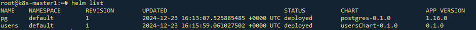

# Домашнее задание 4

## Инфраструктурные паттерны
### Цель: В этом ДЗ вы создадите простейший RESTful CRUD

### Задача
- **Сделать простейший RESTful CRUD по созданию, удалению, просмотру и обновлению пользователей.**

- **Добавить базу данных для приложения**

- **Конфигурация приложения должна хранится в Configmaps.**
- **Доступы к БД должны храниться в Secrets.**
- **Первоначальные миграции должны быть оформлены в качестве Job-ы, если это требуется.**
- **Ingress-ы должны также вести на url arch.homework/ (как и в прошлом задании)**


### На выходе необходимо предоставить
1. Ссылка на директорию в github, где находится директория с манифестами кубернетеса
2. Инструкция по запуску приложения.
    - команда установки БД из helm, вместе с файлом values.yaml.
    - команда применения первоначальных миграций
    - команда kubectl apply -f, которая запускает в правильном порядке манифесты кубернетеса

3. Postman коллекция, в которой будут представлены примеры запросов к сервису на создание, получение, изменение и удаление пользователя. Важно: в postman коллекции использовать базовый url - arch.homework.
4. Проверить корректность работы приложения используя созданную коллекцию newman run коллекция_постман и приложить скриншот/вывод исполнения корректной работы


---
## Команда создания PV
```kubectl apply -f ./postgres/templates/postgres-pv.yaml```

---

## Манифест создания Persistent Volume для БД
```apiVersion: v1
kind: PersistentVolume
metadata:
  name: postgresdb-pv
  labels:
    type: local
spec:
  # storageClassName: manual
  capacity:
    storage: 1Gi
  accessModes:
    - ReadWriteOnce
  hostPath:
    path: "/mnt/pgdata"
```

## Манифест secret.yaml
```apiVersion: v1
kind: Secret
metadata:
  name: users-secret
type: Opaque
data:
  dbhost: MTAuMTAwLjEwLjc=
  dbport: NTQzMg==
  dbuser: cG9zdGdyZXM=
  dbpass: cG9zdGdyZXM=
  dbname: dXNlcnM=
```

---

## Команда установки через k8s
```kubectl apply -f ./manifest/```

---

## Команда установки PostgreSQL через Helm
```helm install pg postgres```

## Команда установки приложения через Helm
```helm install users  usersChart```


### Проверка установки через Helm


### Проверка сущностей k8s


### Проверка доступности по имени


### Коллекция Postman находится в файле users.postman_collection.json
### Тест коллекции Postman в Newman

