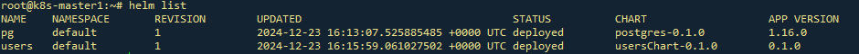
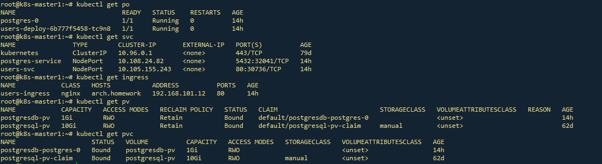
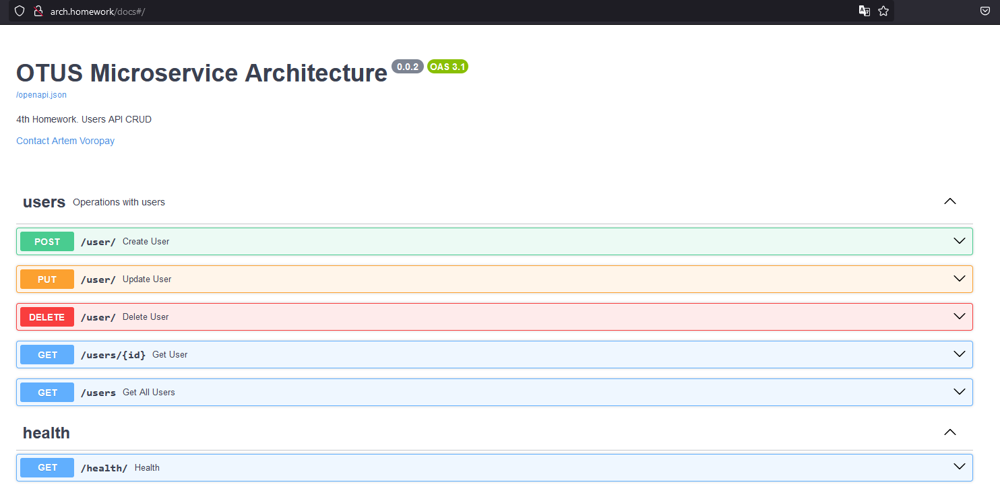
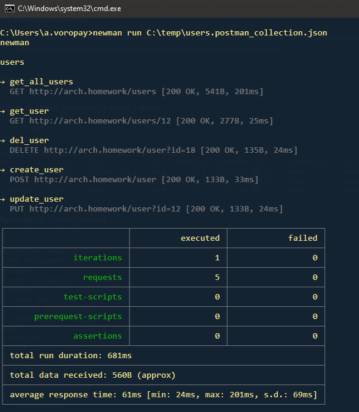

# Домашнее задание 5

## Prometheus. Grafana
### Цель: В этом ДЗ вы научитесь инструментировать сервис.

### Задача
- **Сделать дашборд в Графане, в котором были бы метрики с разбивкой по API методам**
  1.  Latency (response time) с квантилями по 0.5, 0.95, 0.99, max
  2.  RPS
  3.  Error Rate - количество 500ых ответов


- **Добавить в дашборд графики с метрикам в целом по сервису, взятые с nginx-ingress-controller:**
  1.  Latency (response time) с квантилями по 0.5, 0.95, 0.99, max
  2.  RPS
  3.  Error Rate - количество 500ых ответов


- **Настроить алертинг в графане на Error Rate и Latency.**


### На выходе необходимо предоставить
1. Cкриншоты дашбордов с графиками в момент стресс-тестирования сервиса. Например, после 5-10 минут нагрузки.
2. json-дашборды.


---
## Команда создания PV
```kubectl apply -f ./postgres/templates/postgres-pv.yaml```

---

## Манифест создания Persistent Volume для БД
```apiVersion: v1
kind: PersistentVolume
metadata:
  name: postgresdb-pv
  labels:
    type: local
spec:
  # storageClassName: manual
  capacity:
    storage: 1Gi
  accessModes:
    - ReadWriteOnce
  hostPath:
    path: "/mnt/pgdata"
```

## Манифест secret.yaml
```apiVersion: v1
kind: Secret
metadata:
  name: users-secret
type: Opaque
data:
  dbhost: MTAuMTAwLjEwLjc=
  dbport: NTQzMg==
  dbuser: cG9zdGdyZXM=
  dbpass: cG9zdGdyZXM=
  dbname: dXNlcnM=
```

---

## Команда установки через k8s
```kubectl apply -f ./manifest/```

---

## Команда установки PostgreSQL через Helm
```helm install pg postgres```

## Команда установки приложения через Helm
```helm install users  usersChart```


### Проверка установки через Helm


### Проверка сущностей k8s


### Проверка доступности по имени



### Коллекция Postman находится в файле users.postman_collection.json
### Тест коллекции Postman в Newman

