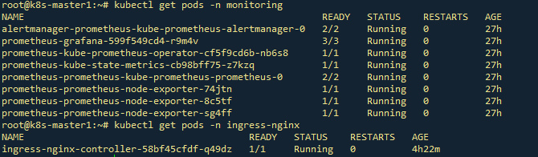
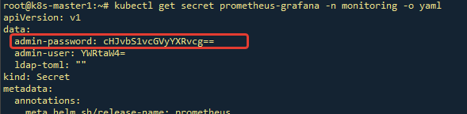
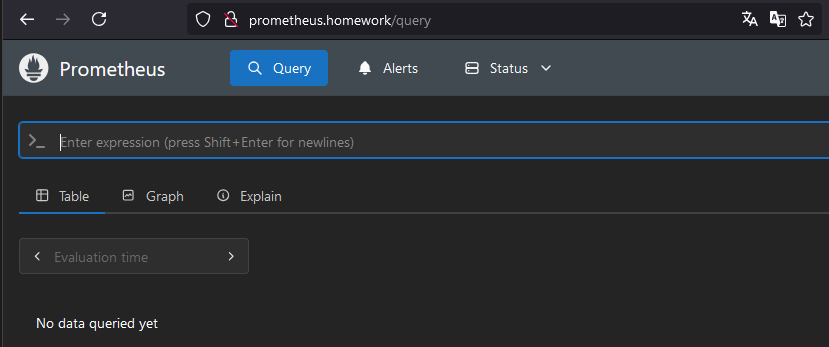
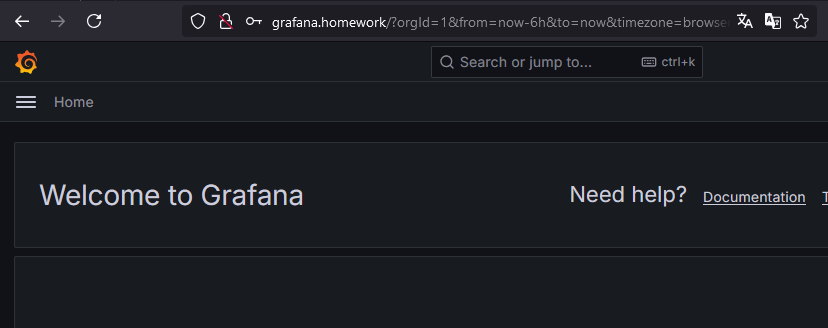
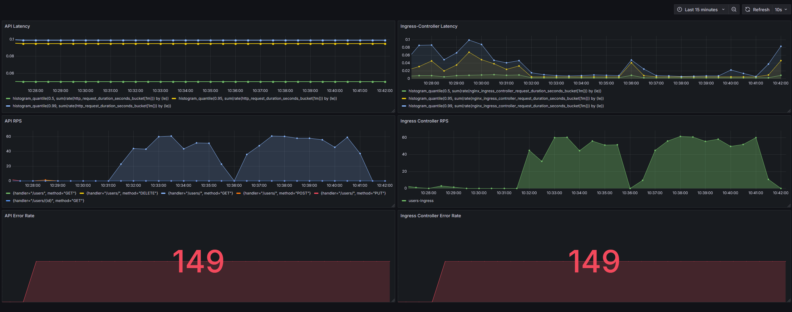

# Домашнее задание 5

## Prometheus. Grafana
### Цель: В этом ДЗ вы научитесь инструментировать сервис.

### Задача
- **Сделать дашборд в Графане, в котором были бы метрики с разбивкой по API методам**
  1.  Latency (response time) с квантилями по 0.5, 0.95, 0.99, max
  2.  RPS
  3.  Error Rate - количество 500ых ответов


- **Добавить в дашборд графики с метрикам в целом по сервису, взятые с nginx-ingress-controller:**
  1.  Latency (response time) с квантилями по 0.5, 0.95, 0.99, max
  2.  RPS
  3.  Error Rate - количество 500ых ответов


- **Настроить алертинг в графане на Error Rate и Latency.**


### На выходе необходимо предоставить
1. Cкриншоты дашбордов с графиками в момент стресс-тестирования сервиса. Например, после 5-10 минут нагрузки.
2. json-дашборды.


## Устанавливаем prometheus-stack

```
  helm repo add prometheus-community https://prometheus-community.github.io/helm-charts
  helm repo update
  helm install prometheus prometheus-community/kube-prometheus-stack  -f prometheus-values.yaml -n monitoring
```

## Устанавливаем Ingress Nginx с включенным сбором метрик

```
  helm upgrade --install ingress-nginx ingress-nginx \
  --repo https://kubernetes.github.io/ingress-nginx \
  --namespace ingress-nginx --create-namespace \
  --set controller.metrics.enabled=true \
  --set controller.metrics.serviceMonitor.enabled=true \
  --set controller.metrics.serviceMonitor.additionalLabels.release="prometheus"
```

---
### Проверим установку


---
### Для доступности Prometheus и Grafana снаружи кластера: 
1. Применим манифесты Service и Ingress 
из дирректории prometheus. 
2. В hosts добавим 2 узла
  - prometheus.homework
  - grafana.homework

Чтобы узнать пароль на Grafana смотрим Secret




### Проверим доступность






---


## JSON дашборда находится в файле: [./grafana/dashboard.json](./grafana/dashboard.json)
---

### Состояние системы в момент нагрузки
