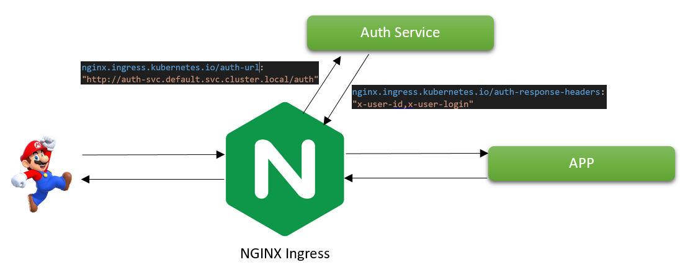
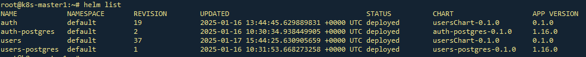
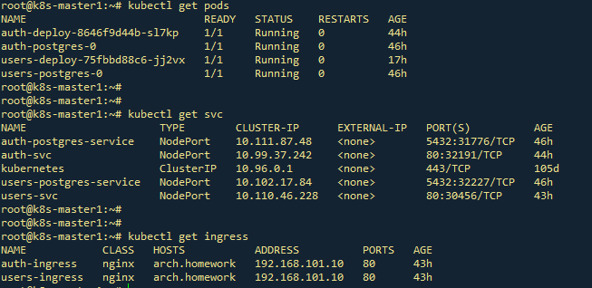

# Домашнее задание 6

## Backend for frontends. Apigateway
### Цель: В этом ДЗ вы научитесь добавлять в приложение аутентификацию и регистрацию пользователей.

### Задача
- **Добавить в приложение аутентификацию и регистрацию пользователей.**

- **Реализовать сценарий "Изменение и просмотр данных в профиле клиента".**

- **Пользователь регистрируется. Заходит под собой и по определенному урлу получает данные о своем профиле.**

- **Пользователь vожет поменять данные в профиле. Данные профиля  для чтения и редактирования не должны быть доступны другим клиентам (аутентифицированным или нет).**


### На выходе необходимо предоставить
1. Описание архитектурного решения и схема взаимодействия сервисов (в виде картинки)
2. Команда установки приложения (из helm-а или из манифестов). Обязательно указать в каком namespace нужно устанавливать. 
    - команда установки БД из helm, вместе с файлом values.yaml.
    - команда применения первоначальных миграций
    - команда kubectl apply -f, которая запускает в правильном порядке манифесты кубернетеса

3. Команда установки api-gateway, если он отличен от nginx-ingress..
4. Тесты постмана, которые прогоняют сценарий:
   - регистрация пользователя 1
   - проверка, что изменение и получение профиля пользователя недоступно без логина
   - вход пользователя 1
   - изменение профиля пользователя 1
   - проверка, что профиль поменялся
   - выход* (если есть)
   - регистрация пользователя 2
   - вход пользователя 2
   - проверка, что пользователь2 не имеет доступа на чтение и редактирование профиля пользователя1.

### В тестах обязательно 

   - наличие {{baseUrl}} для урла
   - использование домена arch.homework в качестве initial значения {{baseUrl}}
   - использование сгенерированных случайно данных в сценарии
   - отображение данных запроса и данных ответа при запуске из командной строки с помощью newman.


### 1. Описание архитектурного решения и схема взаимодействия сервисов (в виде картинки)


В качестве API Gateway используется NGINX Ingress
Для перенаправления запросов в сервис аутентификации и для получения из него заголовков в манифесте Ingress целевого микросервиса укажем следующие аннотации

```
    nginx.ingress.kubernetes.io/auth-url: "http://auth-svc.default.svc.cluster.local/auth"
    nginx.ingress.kubernetes.io/auth-response-headers: "x-user-id,x-user-login"
```

- Запросы  /auth, /logoff, /login, /register будут направлены в AuthService
- В случае удачной аутентификации, 
  будет создана сессия, 
  сгенерирован JWT, 
  установлены cookie, сождержащие id-сессии и токен
- Все запросы, направленные в основной микросервис будут направлены в сервис аутентификации
- Сервис аутентификации вычитывает id сессии из кук и проверяет, существует ли данная сессия
- Если сессия существует, запрос перенаправляется в основной сервис с установленными заголовками x-user-id, x-user-login


---
## Команды развёртывания
```
#Создание PV для БД
kubectl apply -f postgres-auth/postgres-pv.yaml 
kubectl apply -f postgres-users/postgres-pv.yaml 

#Установка БД
helm install auth-postgres ./postgres-auth/
helm install users-postgres ./postgres-users/

#Установка сервисов
helm install  auth ./authChart/ 
helm install  users ./usersChart/

```


### Проверка установки через Helm


### Проверка сущностей k8s



### Коллекция Postman находится в файле: [./OTUS6th.postman_collection.json](./OTUS6th.postman_collection.json)
### Тест коллекции Postman в Newman

```
C:\Users\a.voropay>newman run "C:\temp\OTUS - 6th homework.postman_collection.json" --verbose
newman

OTUS - 6th homework

→ register1
  POST http://arch.homework/register
  200 OK ★ 175ms time ★ 434B↑ 133B↓ size ★ 9↑ 4↓ headers ★ 0 cookies
  ┌ ↑ raw ★ 147B
  │ {
  │   "login": "Mayra95",
  │   "first_name": "Jerry",
  │   "last_name": "Walker",
  │   "email": "Giles86@hotmail.com",
  │   "password": "dwZX_SOJVpVs3p8"
  │ }
  └
  ┌ ↓ application/json ★ text ★ json ★ utf8 ★ 2B
  │ 30
  └
  prepare   wait   dns-lookup   tcp-handshake   transfer-start   download   process   total
  22ms      21ms   12ms         3ms             125ms            12ms       1ms       198ms


→ get_user_unauth
  GET http://arch.homework/users/
  401 Unauthorized ★ 10ms time ★ 231B↑ 308B↓ size ★ 7↑ 4↓ headers ★ 0 cookies
  ┌ ↓ text/html ★ text ★ html ★ utf8 ★ 172B
  │ <html>
  │ <head><title>401 Authorization Required</title></head>
  │ <body>
  │ <center><h1>401 Authorization Required</h1></center>
  │ <hr><center>nginx</center>
  │ </body>
  │ </html>
  └
  prepare   wait    dns-lookup   tcp-handshake   transfer-start   download   process   total
  1ms       832µs   (cache)      (cache)         6ms              1ms        106µs     11ms


→ update_user_unauth
  PUT http://arch.homework/users/
  401 Unauthorized ★ 8ms time ★ 474B↑ 308B↓ size ★ 9↑ 4↓ headers ★ 0 cookies
  ┌ ↑ raw ★ 190B
  │ {
  │   "login": "Mayra95",
  │   "first_name": "Jerry",
  │   "last_name": "Walker",
  │   "email": "Giles86@hotmail.com",
  │   "password": "dwZX_SOJVpVs3p8",
  │   "age": 716,
  │   "phone": "597-807-4569"
  │ }
  └
  ┌ ↓ text/html ★ text ★ html ★ utf8 ★ 172B
  │ <html>
  │ <head><title>401 Authorization Required</title></head>
  │ <body>
  │ <center><h1>401 Authorization Required</h1></center>
  │ <hr><center>nginx</center>
  │ </body>
  │ </html>
  └
  prepare   wait    dns-lookup   tcp-handshake   transfer-start   download   process   total
  933µs     371µs   (cache)      (cache)         5ms              1ms        90µs      8ms


→ login1
  POST http://arch.homework/login
  200 OK ★ 23ms time ★ 334B↑ 812B↓ size ★ 9↑ 12↓ headers ★ 0 cookies
  ┌ ↑ raw ★ 51B
  │ {"login": "Mayra95", "password": "dwZX_SOJVpVs3p8"}
  └
  ┌ ↓ application/json ★ text ★ json ★ utf8 ★ 128B
  │ {"id":30,"login":"Mayra95","first_name":"Jerry","last_name":"Walker","email":"Giles86@hotmail.com","password":"dwZ
  │ X_SOJVpVs3p8"}
  └
  prepare   wait    dns-lookup   tcp-handshake   transfer-start   download   process   total
  1ms       503µs   (cache)      (cache)         14ms             7ms        105µs     24ms


→ update_user
  PUT http://arch.homework/users/
  200 OK ★ 118ms time ★ 675B↑ 135B↓ size ★ 10↑ 4↓ headers ★ 0 cookies
  ┌ ↑ raw ★ 190B
  │ {
  │   "login": "Mayra95",
  │   "first_name": "Jerry",
  │   "last_name": "Walker",
  │   "email": "Giles86@hotmail.com",
  │   "password": "dwZX_SOJVpVs3p8",
  │   "age": 832,
  │   "phone": "825-750-5889"
  │ }
  └
  ┌ ↓ application/json ★ text ★ json ★ utf8 ★ 4B
  │ null
  └
  prepare   wait    dns-lookup   tcp-handshake   transfer-start   download   process   total
  1ms       830µs   (cache)      (cache)         115ms            1ms        93µs      119ms


→ get_user
  GET http://arch.homework/users/
  200 OK ★ 16ms time ★ 432B↑ 265B↓ size ★ 8↑ 4↓ headers ★ 0 cookies
  ┌ ↓ application/json ★ text ★ json ★ utf8 ★ 132B
  │ {"id":30,"login":"Mayra95","first_name":"Jerry","last_name":"Walker","email":"Giles86@hotmail.com","age":832,"phon
  │ e":"825-750-5889"}
  └
  prepare   wait    dns-lookup   tcp-handshake   transfer-start   download   process   total
  1ms       429µs   (cache)      (cache)         14ms             1ms        168µs     16ms


→ logoff1
  GET http://arch.homework/logoff
  200 OK ★ 9ms time ★ 432B↑ 355B↓ size ★ 8↑ 6↓ headers ★ 0 cookies
  ┌ ↓ application/json ★ text ★ json ★ utf8 ★ 23B
  │ {"status":"logged off"}
  └
  prepare   wait    dns-lookup   tcp-handshake   transfer-start   download   process   total
  828µs     780µs   (cache)      (cache)         5ms              2ms        60µs      9ms


→ register2
  POST http://arch.homework/register
  200 OK ★ 11ms time ★ 451B↑ 133B↓ size ★ 9↑ 4↓ headers ★ 0 cookies
  ┌ ↑ raw ★ 164B
  │ {
  │   "login": "Cecelia_Cremin",
  │   "first_name": "Oral",
  │   "last_name": "Collins",
  │   "email": "Maybelle_Crooks46@hotmail.com",
  │   "password": "UHuELGih5Fun5m2"
  │ }
  └
  ┌ ↓ application/json ★ text ★ json ★ utf8 ★ 2B
  │ 31
  └
  prepare   wait    dns-lookup   tcp-handshake   transfer-start   download   process   total
  1ms       595µs   (cache)      (cache)         8ms              1ms        52µs      12ms


→ login2
  POST http://arch.homework/login
  200 OK ★ 12ms time ★ 341B↑ 866B↓ size ★ 9↑ 12↓ headers ★ 0 cookies
  ┌ ↑ raw ★ 58B
  │ {"login": "Cecelia_Cremin", "password": "UHuELGih5Fun5m2"}
  └
  ┌ ↓ application/json ★ text ★ json ★ utf8 ★ 145B
  │ {"id":31,"login":"Cecelia_Cremin","first_name":"Oral","last_name":"Collins","email":"Maybelle_Crooks46@hotmail.com
  │ ","password":"UHuELGih5Fun5m2"}
  └
  prepare   wait    dns-lookup   tcp-handshake   transfer-start   download   process   total
  1ms       768µs   (cache)      (cache)         8ms              1ms        118µs     12ms


→ logoff2
  GET http://arch.homework/logoff
  200 OK ★ 9ms time ★ 442B↑ 355B↓ size ★ 8↑ 6↓ headers ★ 0 cookies
  ┌ ↓ application/json ★ text ★ json ★ utf8 ★ 23B
  │ {"status":"logged off"}
  └
  prepare   wait    dns-lookup   tcp-handshake   transfer-start   download   process   total
  1ms       627µs   (cache)      (cache)         6ms              1ms        91µs      9ms


┌─────────────────────────┬────────────────────┬───────────────────┐
│                         │           executed │            failed │
├─────────────────────────┼────────────────────┼───────────────────┤
│              iterations │                  1 │                 0 │
├─────────────────────────┼────────────────────┼───────────────────┤
│                requests │                 10 │                 0 │
├─────────────────────────┼────────────────────┼───────────────────┤
│            test-scripts │                 11 │                 0 │
├─────────────────────────┼────────────────────┼───────────────────┤
│      prerequest-scripts │                 14 │                 0 │
├─────────────────────────┼────────────────────┼───────────────────┤
│              assertions │                  0 │                 0 │
├─────────────────────────┴────────────────────┴───────────────────┤
│ total run duration: 1815ms                                       │
├──────────────────────────────────────────────────────────────────┤
│ total data received: 803B (approx)                               │
├──────────────────────────────────────────────────────────────────┤
│ average response time: 39ms [min: 8ms, max: 175ms, s.d.: 55ms]   │
├──────────────────────────────────────────────────────────────────┤
│ average DNS lookup time: 12ms [min: 12ms, max: 12ms, s.d.: 0µs]  │
├──────────────────────────────────────────────────────────────────┤
│ average first byte time: 31ms [min: 5ms, max: 125ms, s.d.: 44ms] │
└──────────────────────────────────────────────────────────────────┘
```