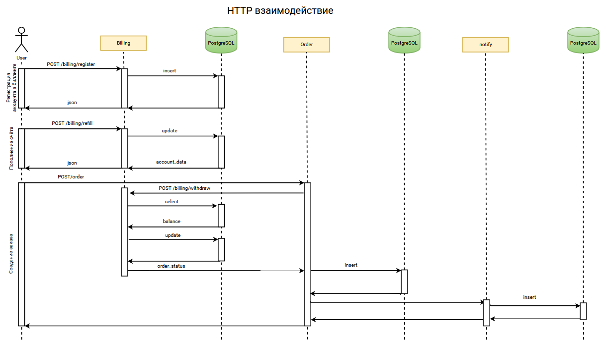
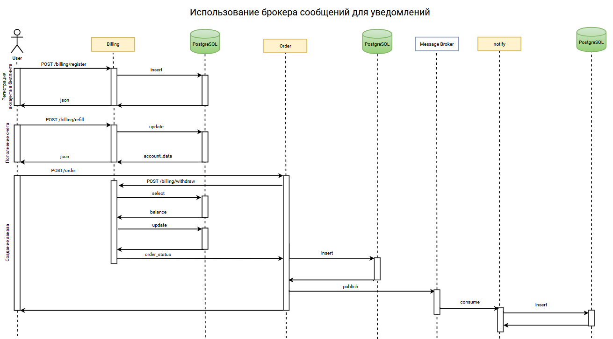
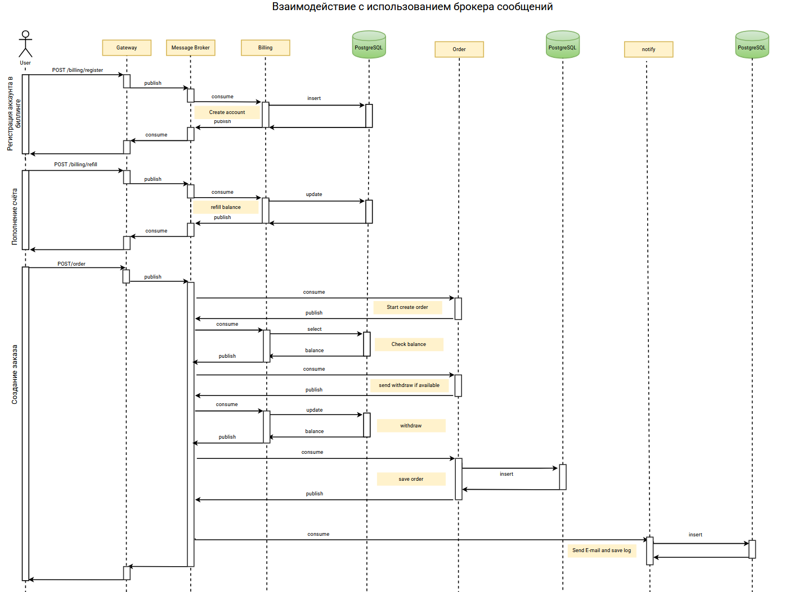
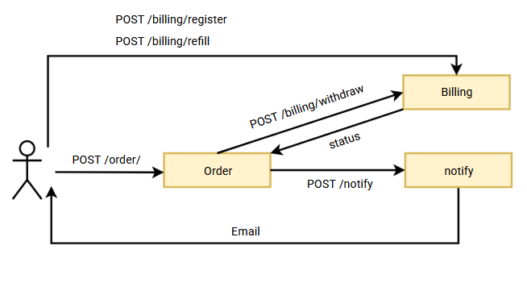
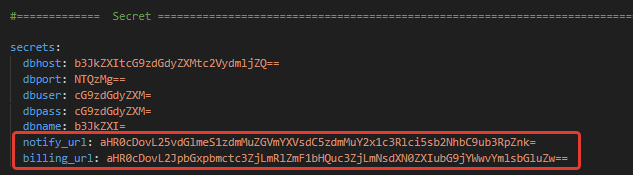
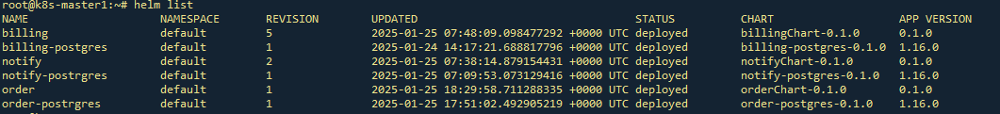
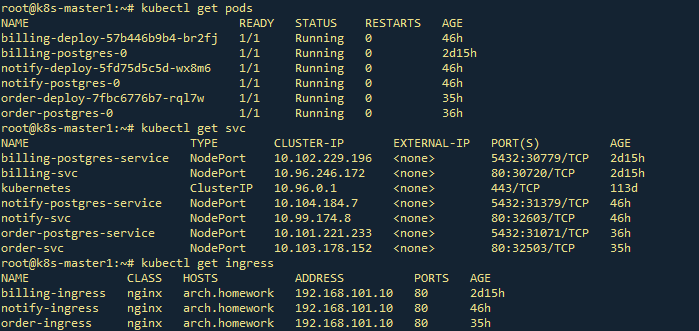

# Домашнее задание 7

## Stream processing
### Цель: В этом ДЗ вы научитесь реализовывать сервис заказа.

### Задача
- **Реализовать сервис заказа. Сервис биллинга. Сервис нотификаций.**

- **При создании пользователя, необходимо создавать аккаунт в сервисе биллинга. 
   В сервисе биллинга должна быть возможность положить деньги на аккаунт и снять деньги**

- **Сервис нотификаций позволяет отправить сообщение на email. И позволяет получить список сообщений по методу API.**

- **Пользователь может создать заказ. У заказа есть параметр - цена заказа.**       

- **Заказ происходит в 2 этапа:**   

  1.  сначала снимаем деньги с пользователя с помощью сервиса биллинга
  2.  отсылаем пользователю сообщение на почту с результатами оформления заказа. Если биллинг подтвердил платеж, должно отослаться письмо счастья. Если нет, то письмо горя.


**ТЕОРЕТИЧЕСКАЯ ЧАСТЬ**

0) Спроектировать взаимодействие сервисов при создании заказов. Предоставить варианты взаимодействий в следующих стилях в виде sequence диаграммы с описанием API на IDL:





### На выходе необходимо предоставить
0. описание архитектурного решения и схема взаимодействия сервисов (в виде картинки)

1. команда установки приложения (из helm-а или из манифестов). Обязательно указать в каком namespace нужно устанавливать.

2. тесты постмана, которые прогоняют сценарий: 
   
    1.  Создать пользователя. Должен создаться аккаунт в биллинге.
    2.  Положить деньги на счет пользователя через сервис биллинга.
    3.  Сделать заказ, на который хватает денег.
    4.  Посмотреть деньги на счету пользователя и убедиться, что их сняли.
    5.  Посмотреть в сервисе нотификаций отправленные сообщения и убедиться, что сообщение отправилось
    6.  Сделать заказ, на который не хватает денег.
    7.  Посмотреть деньги на счету пользователя и убедиться, что их количество не поменялось.
    8.  Посмотреть в сервисе нотификаций отправленные сообщения и убедиться, что сообщение отправилось.

### В тестах обязательно 

   - наличие {{baseUrl}} для урла
   - использование домена arch.homework в качестве initial значения {{baseUrl}}
   - отображение данных запроса и данных ответа при запуске из командной строки с помощью newman.


### 0. Описание архитектурного решения и схема взаимодействия сервисов (в виде картинки)

Взаимодействие сервисов организовано по HTTP



- Для регистрации пользователя в сервисе Биллинга используется метод ```POST /billing/register```
- Для пополнения баланса используется метод ```POST /billing/refill```
- Запрос ```POST /order``` отправляется сервису Заказ для создания заказа
- Сервис Заказ "знает" местонахождение сервисов Биллинга и Нотификаций  (URL внутри кластера передаются в Secret). 

- Сервис Заказ отправляет в Биллинг запрос на списание средств ```POST /billing/withdraw```
- В случае удачного списания ```(status == 200)```, сервис Заказ отправляет запрос в сервис Нотификаций ```POST /notify``` с сообщением об упешном оформлении заказа
- В случае неудачи ```(status != 200)```, сервис Заказ отправляет запрос в сервис Нотификаций ```POST /notify``` с сообщением о нехватке средств или ошибке
- Для просмотра отправленных сообщения служит метод сервиса Нотификаций ```GET /notify/log/{login}```
 


---
## 1. Команды развёртывания
```
#Создание PV для БД
kubectl apply -f postgres-billing/postgres-pv.yaml 
kubectl apply -f postgres-notify/postgres-pv.yaml 
kubectl apply -f postgres-order/postgres-pv.yaml 

#Установка БД
helm install billing-postgres ./postgres-billing/
helm install notify-postrgres ./postgres-notify/
helm install order-postrgres ./postgres-order/

#Установка сервисов
helm install billing ./billingChart/
helm install notify ./notifyChart/
helm install order ./orderChart/

```


### Проверка установки через Helm


### Проверка сущностей k8s



### 2. Коллекция Postman находится в файле: [./OTUS7homework.postman_collection.json](./OTUS7homework.postman_collection.json)
### Тест коллекции Postman в Newman

```
C:\temp>newman run OTUS7homework.postman_collection.json --verbose
newman

OTUS - 7th homework

→ register
  POST http://arch.homework/billing/register?login=Aurore56
  200 OK ★ 212ms time ★ 276B↑ 166B↓ size ★ 8↑ 4↓ headers ★ 0 cookies
  ┌ ↓ application/json ★ text ★ json ★ utf8 ★ 34B
  │ {"login":"Aurore56","balance":0.0}
  └
  prepare   wait   dns-lookup   tcp-handshake   transfer-start   download   process   total
  41ms      24ms   2ms          16ms            154ms            13ms       1ms       253ms


→ refill
  POST http://arch.homework/billing/refill
  200 OK ★ 28ms time ★ 339B↑ 168B↓ size ★ 9↑ 4↓ headers ★ 0 cookies
  ┌ ↑ raw ★ 47B
  │ {
  │   "login": "Aurore56",
  │   "balance" : 900
  │ }
  └
  ┌ ↓ application/json ★ text ★ json ★ utf8 ★ 36B
  │ {"login":"Aurore56","balance":900.0}
  └
  prepare   wait   dns-lookup   tcp-handshake   transfer-start   download   process   total
  3ms       1ms    (cache)      (cache)         21ms             3ms        353µs     31ms


→ order_success
  POST http://arch.homework/orders/
  200 OK ★ 263ms time ★ 383B↑ 152B↓ size ★ 9↑ 4↓ headers ★ 0 cookies
  ┌ ↑ raw ★ 98B
  │ {
  │   "login": "Aurore56",
  │   "e_mail": "Gage_Lind@gmail.com",
  │   "id_cart": 0,
  │   "amount": 100
  │ }
  └
  ┌ ↓ application/json ★ text ★ json ★ utf8 ★ 20B
  │ {"id":14,"status":1}
  └
  prepare   wait    dns-lookup   tcp-handshake   transfer-start   download   process   total
  28ms      837µs   (cache)      (cache)         258ms            2ms        158µs     290ms


→ check_balance
  GET http://arch.homework/billing/account/Aurore56
  200 OK ★ 19ms time ★ 249B↑ 168B↓ size ★ 7↑ 4↓ headers ★ 0 cookies
  ┌ ↓ application/json ★ text ★ json ★ utf8 ★ 36B
  │ {"login":"Aurore56","balance":800.0}
  └
  prepare   wait    dns-lookup   tcp-handshake   transfer-start   download   process   total
  1ms       392µs   (cache)      (cache)         16ms             1ms        90µs      19ms


→ check_notify
  GET http://arch.homework/notify/log/Aurore56
  200 OK ★ 22ms time ★ 244B↑ 299B↓ size ★ 7↑ 4↓ headers ★ 0 cookies
  ┌ ↓ application/json ★ text ★ json ★ utf8 ★ 166B
  │ [{"id":22,"login":"Aurore56","email":"Gage_Lind@gmail.com","dtime":"2025-01-27T06:01:27.018191","text":"Заказ успе
  │ шно оформлен","is_sended":true}]
  └
  prepare   wait    dns-lookup   tcp-handshake   transfer-start   download   process   total
  919µs     524µs   (cache)      (cache)         20ms             1ms        88µs      22ms


→ order_exceed
  POST http://arch.homework/orders/
  400 Bad Request ★ 70ms time ★ 384B↑ 161B↓ size ★ 9↑ 4↓ headers ★ 0 cookies
  ┌ ↑ raw ★ 99B
  │ {
  │   "login": "Aurore56",
  │   "e_mail": "Gage_Lind@gmail.com",
  │   "id_cart": 0,
  │   "amount": 1000
  │ }
  └
  ┌ ↓ application/json ★ text ★ json ★ utf8 ★ 20B
  │ {"id":15,"status":0}
  └
  prepare   wait    dns-lookup   tcp-handshake   transfer-start   download   process   total
  28ms      553µs   (cache)      (cache)         67ms             1ms        119µs     98ms


→ check_balance2
  GET http://arch.homework/billing/account/Aurore56
  200 OK ★ 24ms time ★ 249B↑ 168B↓ size ★ 7↑ 4↓ headers ★ 0 cookies
  ┌ ↓ application/json ★ text ★ json ★ utf8 ★ 36B
  │ {"login":"Aurore56","balance":800.0}
  └
  prepare   wait    dns-lookup   tcp-handshake   transfer-start   download   process   total
  1ms       847µs   (cache)      (cache)         20ms             1ms        171µs     24ms


→ check_notify2
  GET http://arch.homework/notify/log/Aurore56
  200 OK ★ 23ms time ★ 244B↑ 573B↓ size ★ 7↑ 4↓ headers ★ 0 cookies
  ┌ ↓ application/json ★ text ★ json ★ utf8 ★ 440B
  │ [{"id":22,"login":"Aurore56","email":"Gage_Lind@gmail.com","dtime":"2025-01-27T06:01:27.018191","text":"Заказ успе
  │ шно оформлен","is_sended":true},{"id":23,"login":"Aurore56","email":"Gage_Lind@gmail.com","dtime":"2025-01-27T06:0
  │ 1:27.558617","text":"Недостаточно средств для оформления заказа. Текущий баланс: 800.0.  Сумма заказа: 1000.0 ","i
  │ s_sended":true}]
  └
  prepare   wait    dns-lookup   tcp-handshake   transfer-start   download   process   total
  1ms       684µs   (cache)      (cache)         18ms             3ms        234µs     24ms


┌─────────────────────────┬────────────────────┬────────────────────┐
│                         │           executed │             failed │
├─────────────────────────┼────────────────────┼────────────────────┤
│              iterations │                  1 │                  0 │
├─────────────────────────┼────────────────────┼────────────────────┤
│                requests │                  8 │                  0 │
├─────────────────────────┼────────────────────┼────────────────────┤
│            test-scripts │                  9 │                  0 │
├─────────────────────────┼────────────────────┼────────────────────┤
│      prerequest-scripts │                 12 │                  0 │
├─────────────────────────┼────────────────────┼────────────────────┤
│              assertions │                  0 │                  0 │
├─────────────────────────┴────────────────────┴────────────────────┤
│ total run duration: 2s                                            │
├───────────────────────────────────────────────────────────────────┤
│ total data received: 788B (approx)                                │
├───────────────────────────────────────────────────────────────────┤
│ average response time: 82ms [min: 19ms, max: 263ms, s.d.: 91ms]   │
├───────────────────────────────────────────────────────────────────┤
│ average DNS lookup time: 2ms [min: 2ms, max: 2ms, s.d.: 0µs]      │
├───────────────────────────────────────────────────────────────────┤
│ average first byte time: 72ms [min: 16ms, max: 258ms, s.d.: 83ms] │
└───────────────────────────────────────────────────────────────────┘
```