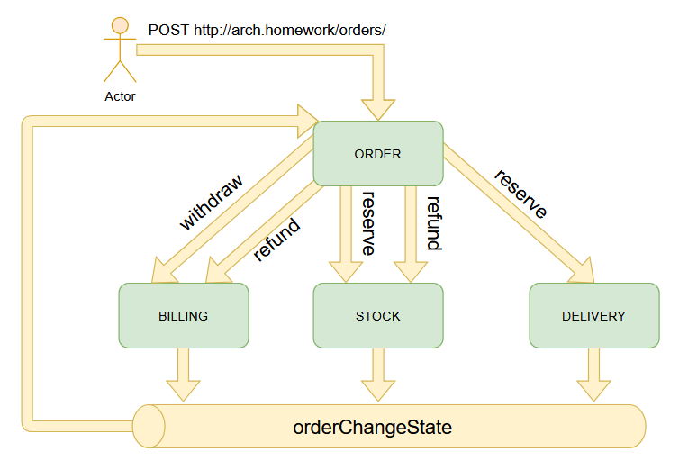
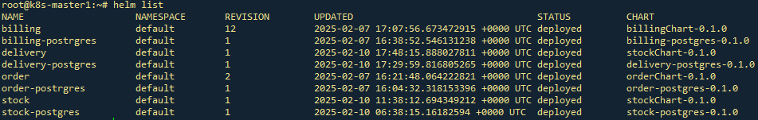
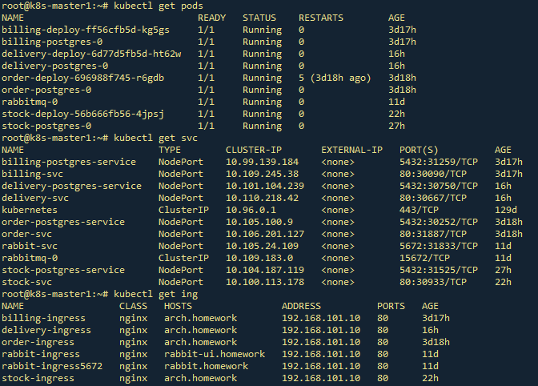

# Домашнее задание 8

## Распределенные транзакции
### Цель: В этом ДЗ вы научитесь реализовывать распределенную транзакцию. 

### Задача
- **Реализовать сервисы "Платеж", "Склад", "Доставка".**

- **Для сервиса "Заказ", в рамках метода "создание заказа" реализовать механизм распределенной транзакции (на основе Саги или двухфазного коммита).**

- **Во время создания заказа необходимо:**

  1.  в сервисе "Платеж" убедиться, что платеж прошел
  2.  в сервисе "Склад" зарезервировать конкретный товар на складе
  3.  в сервисе "Доставка" зарезервировать курьера на конкретный слот времени.

**Если хотя бы один из пунктов не получилось сделать, необходимо откатить все остальные изменения.**


### На выходе необходимо предоставить
0. описание того, какой паттерн для реализации распределенной транзакции использовался

1.  команда установки приложения (из helm-а или из манифестов). Обязательно указать в каком namespace нужно устанавливать и команду создания namespace, если это важно для сервиса.

2. тесты в postman
   

### В тестах обязательно 

   - использование домена arch.homework в качестве initial значения {{baseUrl}}


### 0. Описание архитектурного решения и схема взаимодействия сервисов (в виде картинки)




- Для реализации используется оркестрируемая сага.
- В роли оркестратора выступает сервис Заказ
- Взаимодействие сервисов организовано через очереди
- Оркестратор отправляет сообщения в другие сервисы и вычитывает сообщения от них из очереди ```orderChangeState```
- При получении сообщения о неудачной транзакции, оркестратор отправляет сообщения для запуска компенсирующих транзакций

 


---
## 1. Команды развёртывания
```
#Создание PV для БД
kubectl apply -f postgres-order/postgres-pv.yaml 
kubectl apply -f postgres-billing/postgres-pv.yaml 
kubectl apply -f postgres-stock/postgres-pv.yaml 
kubectl apply -f postgres-delivery/postgres-pv.yaml 

#Установка БД
helm install order-postrgres ./postgres-order/
helm install billing-postgres ./postgres-billing/
helm install stock-postrgres ./postgres-stock/
helm install delivery-postrgres ./postgres-delivery/

#Установка сервисов
helm install order ./orderChart/
helm install billing ./billingChart/
helm install stock ./stockChart/
helm install delivery ./deliveryChart/

```


### Проверка установки через Helm


### Проверка сущностей k8s



### 2. Коллекция Postman находится в файле: [./OTUS_8th_homework.postman_collection.json](./OTUS_8th_homework.postman_collection.json)
### Тест коллекции Postman в Newman

```
newman run OTUS_8th_homework.postman_collection.json --verbose --delay-request 1000
newman

OTUS_8th_homework

→ register_billing
  POST http://arch.homework/billing/register?login=Edmond90
  200 OK ★ 114ms time ★ 276B↑ 166B↓ size ★ 8↑ 4↓ headers ★ 0 cookies
  ┌ ↓ application/json ★ text ★ json ★ utf8 ★ 34B
  │ {"login":"Edmond90","balance":0.0}
  └
  prepare   wait   dns-lookup   tcp-handshake   transfer-start   download   process   total
  49ms      35ms   5ms          37ms            15ms             20ms       878µs     163ms


→ refill
  POST http://arch.homework/billing/refill
  200 OK ★ 15ms time ★ 340B↑ 169B↓ size ★ 9↑ 4↓ headers ★ 0 cookies
  ┌ ↑ raw ★ 48B
  │ {
  │   "login": "Edmond90",
  │   "balance" : 1000
  │ }
  └
  ┌ ↓ application/json ★ text ★ json ★ utf8 ★ 37B
  │ {"login":"Edmond90","balance":1000.0}
  └
  prepare   wait   dns-lookup   tcp-handshake   transfer-start   download   process   total
  1ms       1ms    (cache)      (cache)         9ms              3ms        331µs     16ms


→ register_stock_position
  POST http://arch.homework/stock/register
  200 OK ★ 13ms time ★ 332B↑ 139B↓ size ★ 9↑ 4↓ headers ★ 0 cookies
  ┌ ↑ raw ★ 40B
  │ {"description":"apple", "quantity": 100}
  └
  ┌ ↓ application/json ★ text ★ json ★ utf8 ★ 8B
  │ {"id":1}
  └
  prepare   wait    dns-lookup   tcp-handshake   transfer-start   download   process   total
  1ms       900µs   (cache)      (cache)         10ms             1ms        83µs      14ms


→ order_success
  POST http://arch.homework/orders/
  200 OK ★ 36ms time ★ 438B↑ 173B↓ size ★ 9↑ 4↓ headers ★ 0 cookies
  ┌ ↑ raw ★ 152B
  │ {
  │   "login": "Edmond90",
  │   "e_mail": "Willie53@hotmail.com",
  │   "id_product": 1,
  │   "quntity": 1,
  │   "amount": 1,
  │   "dtime": "2025-01-08 10:00:00"
  │ }
  └
  ┌ ↓ application/json ★ text ★ json ★ utf8 ★ 41B
  │ {"id":40,"login":"Edmond90","amount":1.0}
  └
  prepare   wait    dns-lookup   tcp-handshake   transfer-start   download   process   total
  9ms       614µs   (cache)      (cache)         33ms             1ms        89µs      44ms


→ check_last_order
  GET http://arch.homework/orders/last
  200 OK ★ 14ms time ★ 236B↑ 291B↓ size ★ 7↑ 4↓ headers ★ 0 cookies
  ┌ ↓ application/json ★ text ★ json ★ utf8 ★ 158B
  │ {"id":40,"login":"Edmond90","e_mail":"Willie53@hotmail.com","id_product":1,"quantity":1,"amount":1.0,"status":"Del
  │ ivery Succes","dtime":"2025-01-08T10:00:00"}
  └
  prepare   wait   dns-lookup   tcp-handshake   transfer-start   download   process   total
  1ms       2ms    (cache)      (cache)         9ms              1ms        164µs     14ms


→ check_balance
  GET http://arch.homework/billing/account/Edmond90
  200 OK ★ 12ms time ★ 249B↑ 168B↓ size ★ 7↑ 4↓ headers ★ 0 cookies
  ┌ ↓ application/json ★ text ★ json ★ utf8 ★ 36B
  │ {"login":"Edmond90","balance":999.0}
  └
  prepare   wait   dns-lookup   tcp-handshake   transfer-start   download   process   total
  2ms       1ms    (cache)      (cache)         9ms              1ms        286µs     14ms


→ get_stock_items
  GET http://arch.homework/stock
  200 OK ★ 9ms time ★ 230B↑ 178B↓ size ★ 7↑ 4↓ headers ★ 0 cookies
  ┌ ↓ application/json ★ text ★ json ★ utf8 ★ 46B
  │ [{"id":1,"description":"apple","quantity":99}]
  └
  prepare   wait    dns-lookup   tcp-handshake   transfer-start   download   process   total
  1ms       354µs   (cache)      (cache)         7ms              876µs      59µs      9ms


→ get_delivery_pool
  GET http://arch.homework/delivery
  200 OK ★ 16ms time ★ 233B↑ 186B↓ size ★ 7↑ 4↓ headers ★ 0 cookies
  ┌ ↓ application/json ★ text ★ json ★ utf8 ★ 54B
  │ [{"id":4,"id_order":40,"dtime":"2025-01-08T10:00:00"}]
  └
  prepare   wait   dns-lookup   tcp-handshake   transfer-start   download   process   total
  2ms       1ms    (cache)      (cache)         12ms             1ms        177µs     17ms


→ order_exceed_money
  POST http://arch.homework/orders/
  200 OK ★ 33ms time ★ 442B↑ 177B↓ size ★ 9↑ 4↓ headers ★ 0 cookies
  ┌ ↑ raw ★ 156B
  │ {
  │   "login": "Edmond90",
  │   "e_mail": "Willie53@hotmail.com",
  │   "id_product": 1,
  │   "quntity": 1,
  │   "amount": 10000,
  │   "dtime": "2025-01-08 10:00:00"
  │ }
  └
  ┌ ↓ application/json ★ text ★ json ★ utf8 ★ 45B
  │ {"id":41,"login":"Edmond90","amount":10000.0}
  └
  prepare   wait    dns-lookup   tcp-handshake   transfer-start   download   process   total
  8ms       332µs   (cache)      (cache)         29ms             2ms        248µs     41ms


→ check_last_order_2
  GET http://arch.homework/orders/last
  200 OK ★ 15ms time ★ 236B↑ 296B↓ size ★ 7↑ 4↓ headers ★ 0 cookies
  ┌ ↓ application/json ★ text ★ json ★ utf8 ★ 163B
  │ {"id":41,"login":"Edmond90","e_mail":"Willie53@hotmail.com","id_product":1,"quantity":1,"amount":10000.0,"status":
  │ "Not enough money","dtime":"2025-01-08T10:00:00"}
  └
  prepare   wait    dns-lookup   tcp-handshake   transfer-start   download   process   total
  1ms       599µs   (cache)      (cache)         11ms             2ms        169µs     16ms


→ check_balance_2
  GET http://arch.homework/billing/account/Edmond90
  200 OK ★ 11ms time ★ 249B↑ 168B↓ size ★ 7↑ 4↓ headers ★ 0 cookies
  ┌ ↓ application/json ★ text ★ json ★ utf8 ★ 36B
  │ {"login":"Edmond90","balance":999.0}
  └
  prepare   wait    dns-lookup   tcp-handshake   transfer-start   download   process   total
  635µs     299µs   (cache)      (cache)         9ms              731µs      30µs      10ms


→ get_stock_items_2
  GET http://arch.homework/stock
  200 OK ★ 9ms time ★ 230B↑ 178B↓ size ★ 7↑ 4↓ headers ★ 0 cookies
  ┌ ↓ application/json ★ text ★ json ★ utf8 ★ 46B
  │ [{"id":1,"description":"apple","quantity":99}]
  └
  prepare   wait    dns-lookup   tcp-handshake   transfer-start   download   process   total
  610µs     298µs   (cache)      (cache)         7ms              669µs      31µs      9ms


→ get_delivery_pool_2
  GET http://arch.homework/delivery
  200 OK ★ 10ms time ★ 233B↑ 186B↓ size ★ 7↑ 4↓ headers ★ 0 cookies
  ┌ ↓ application/json ★ text ★ json ★ utf8 ★ 54B
  │ [{"id":4,"id_order":40,"dtime":"2025-01-08T10:00:00"}]
  └
  prepare   wait    dns-lookup   tcp-handshake   transfer-start   download   process   total
  746µs     290µs   (cache)      (cache)         8ms              673µs      30µs      10ms


→ order_exceed_quantity
  POST http://arch.homework/orders/
  200 OK ★ 36ms time ★ 441B↑ 173B↓ size ★ 9↑ 4↓ headers ★ 0 cookies
  ┌ ↑ raw ★ 155B
  │ {
  │   "login": "Edmond90",
  │   "e_mail": "Willie53@hotmail.com",
  │   "id_product": 1,
  │   "quntity": 1000,
  │   "amount": 1,
  │   "dtime": "2025-01-08 10:00:00"
  │ }
  └
  ┌ ↓ application/json ★ text ★ json ★ utf8 ★ 41B
  │ {"id":42,"login":"Edmond90","amount":1.0}
  └
  prepare   wait    dns-lookup   tcp-handshake   transfer-start   download   process   total
  7ms       565µs   (cache)      (cache)         32ms             1ms        46µs      43ms


→ check_last_order_3
  GET http://arch.homework/orders/last
  200 OK ★ 11ms time ★ 236B↑ 307B↓ size ★ 7↑ 4↓ headers ★ 0 cookies
  ┌ ↓ application/json ★ text ★ json ★ utf8 ★ 174B
  │ {"id":42,"login":"Edmond90","e_mail":"Willie53@hotmail.com","id_product":1,"quantity":1000,"amount":1.0,"status":"
  │ Not enough position quantity","dtime":"2025-01-08T10:00:00"}
  └
  prepare   wait    dns-lookup   tcp-handshake   transfer-start   download   process   total
  961µs     451µs   (cache)      (cache)         8ms              1ms        67µs      11ms


→ check_balance_3
  GET http://arch.homework/billing/account/Edmond90
  200 OK ★ 11ms time ★ 249B↑ 168B↓ size ★ 7↑ 4↓ headers ★ 0 cookies
  ┌ ↓ application/json ★ text ★ json ★ utf8 ★ 36B
  │ {"login":"Edmond90","balance":999.0}
  └
  prepare   wait    dns-lookup   tcp-handshake   transfer-start   download   process   total
  950µs     361µs   (cache)      (cache)         9ms              1ms        77µs      11ms


→ get_stock_items_3
  GET http://arch.homework/stock
  200 OK ★ 16ms time ★ 230B↑ 178B↓ size ★ 7↑ 4↓ headers ★ 0 cookies
  ┌ ↓ application/json ★ text ★ json ★ utf8 ★ 46B
  │ [{"id":1,"description":"apple","quantity":99}]
  └
  prepare   wait    dns-lookup   tcp-handshake   transfer-start   download   process   total
  1ms       589µs   (cache)      (cache)         14ms             1ms        115µs     17ms


→ get_delivery_pool_3
  GET http://arch.homework/delivery
  200 OK ★ 17ms time ★ 233B↑ 186B↓ size ★ 7↑ 4↓ headers ★ 0 cookies
  ┌ ↓ application/json ★ text ★ json ★ utf8 ★ 54B
  │ [{"id":4,"id_order":40,"dtime":"2025-01-08T10:00:00"}]
  └
  prepare   wait   dns-lookup   tcp-handshake   transfer-start   download   process   total
  3ms       1ms    (cache)      (cache)         13ms             1ms        62µs      19ms


→ order_no_delivery
  POST http://arch.homework/orders/
  200 OK ★ 34ms time ★ 438B↑ 173B↓ size ★ 9↑ 4↓ headers ★ 0 cookies
  ┌ ↑ raw ★ 152B
  │ {
  │   "login": "Edmond90",
  │   "e_mail": "Willie53@hotmail.com",
  │   "id_product": 1,
  │   "quntity": 1,
  │   "amount": 1,
  │   "dtime": "2025-01-08 10:00:00"
  │ }
  └
  ┌ ↓ application/json ★ text ★ json ★ utf8 ★ 41B
  │ {"id":43,"login":"Edmond90","amount":1.0}
  └
  prepare   wait    dns-lookup   tcp-handshake   transfer-start   download   process   total
  9ms       356µs   (cache)      (cache)         32ms             811µs      33µs      42ms


→ check_last_order_4
  GET http://arch.homework/orders/last
  200 OK ★ 10ms time ★ 236B↑ 290B↓ size ★ 7↑ 4↓ headers ★ 0 cookies
  ┌ ↓ application/json ★ text ★ json ★ utf8 ★ 157B
  │ {"id":43,"login":"Edmond90","e_mail":"Willie53@hotmail.com","id_product":1,"quantity":1,"amount":1.0,"status":"Del
  │ ivery Error","dtime":"2025-01-08T10:00:00"}
  └
  prepare   wait    dns-lookup   tcp-handshake   transfer-start   download   process   total
  1ms       311µs   (cache)      (cache)         8ms              727µs      37µs      10ms


→ check_balance_4
  GET http://arch.homework/billing/account/Edmond90
  200 OK ★ 11ms time ★ 249B↑ 168B↓ size ★ 7↑ 4↓ headers ★ 0 cookies
  ┌ ↓ application/json ★ text ★ json ★ utf8 ★ 36B
  │ {"login":"Edmond90","balance":999.0}
  └
  prepare   wait    dns-lookup   tcp-handshake   transfer-start   download   process   total
  979µs     482µs   (cache)      (cache)         8ms              1ms        55µs      11ms


→ get_stock_items_4
  GET http://arch.homework/stock
  200 OK ★ 15ms time ★ 230B↑ 178B↓ size ★ 7↑ 4↓ headers ★ 0 cookies
  ┌ ↓ application/json ★ text ★ json ★ utf8 ★ 46B
  │ [{"id":1,"description":"apple","quantity":99}]
  └
  prepare   wait    dns-lookup   tcp-handshake   transfer-start   download   process   total
  1ms       560µs   (cache)      (cache)         13ms             940µs      46µs      16ms


→ get_delivery_pool_4
  GET http://arch.homework/delivery
  200 OK ★ 12ms time ★ 233B↑ 186B↓ size ★ 7↑ 4↓ headers ★ 0 cookies
  ┌ ↓ application/json ★ text ★ json ★ utf8 ★ 54B
  │ [{"id":4,"id_order":40,"dtime":"2025-01-08T10:00:00"}]
  └
  prepare   wait    dns-lookup   tcp-handshake   transfer-start   download   process   total
  2ms       443µs   (cache)      (cache)         9ms              1ms        45µs      13ms


┌─────────────────────────┬───────────────────┬──────────────────┐
│                         │          executed │           failed │
├─────────────────────────┼───────────────────┼──────────────────┤
│              iterations │                 1 │                0 │
├─────────────────────────┼───────────────────┼──────────────────┤
│                requests │                23 │                0 │
├─────────────────────────┼───────────────────┼──────────────────┤
│            test-scripts │                25 │                0 │
├─────────────────────────┼───────────────────┼──────────────────┤
│      prerequest-scripts │                30 │                0 │
├─────────────────────────┼───────────────────┼──────────────────┤
│              assertions │                 0 │                0 │
├─────────────────────────┴───────────────────┴──────────────────┤
│ total run duration: 28s                                        │
├────────────────────────────────────────────────────────────────┤
│ total data received: 1.44kB (approx)                           │
├────────────────────────────────────────────────────────────────┤
│ average response time: 20ms [min: 9ms, max: 114ms, s.d.: 21ms] │
├────────────────────────────────────────────────────────────────┤
│ average DNS lookup time: 5ms [min: 5ms, max: 5ms, s.d.: 0µs]   │
├────────────────────────────────────────────────────────────────┤
│ average first byte time: 14ms [min: 7ms, max: 33ms, s.d.: 8ms] │
└────────────────────────────────────────────────────────────────┘
```