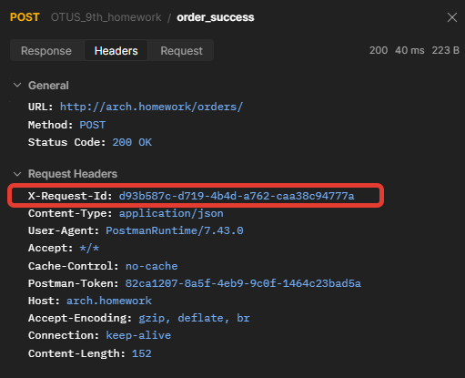

# Домашнее задание 9

## Идемпотентость и коммутативность API в HTTP и очередях
### Цель: В этом ДЗ вы создадите сервис "Заказ" (или научитесь использовать сервис из прошлого занятия) и для одного из его методов, например, "создание заказа" сделаете идемпотетным. 


### На выходе необходимо предоставить
0. описание того, какой паттерн для реализации идемпотентности использовался

1. команда установки приложения (из helm-а или из манифестов). Обязательно указать в каком namespace нужно устанавливать и команду создания namespace, если это важно для сервиса.

2. тесты в postman
   

### В тестах обязательно 

   - использование домена arch.homework в качестве initial значения {{baseUrl}}


### 0. описание того, какой паттерн для реализации идемпотентности использовался




- Применяется ключ идемпотентности
- Ключ добавляется в заголовок POST-запроса 
- Сервис сохраняет значение ключа
- При запросе проверяется наличие ключа в БД
- Если ключ уже существует, запрос отклоняется. Если нет - обрабатывается.

 
---
## 1. Команды развёртывания
```
#Создание PV для БД
kubectl apply -f postgres-order/postgres-pv.yaml 
kubectl apply -f postgres-billing/postgres-pv.yaml 
kubectl apply -f postgres-stock/postgres-pv.yaml 
kubectl apply -f postgres-delivery/postgres-pv.yaml 

#Установка БД
helm install order-postrgres ./postgres-order/
helm install billing-postgres ./postgres-billing/
helm install stock-postrgres ./postgres-stock/
helm install delivery-postrgres ./postgres-delivery/

#Установка сервисов
helm install order ./orderChart/
helm install billing ./billingChart/
helm install stock ./stockChart/
helm install delivery ./deliveryChart/

```


### 2. Коллекция Postman находится в файле: [./OTUS_9th_homework.postman_collection.json](./OTUS_9th_homework.postman_collection.json)
### Тест коллекции Postman в Newman

#### Второй запрос на создание заказа отправляется с тем же UUID. В ответ получаем 400 : {"error":"Request already exists"}

```
newman run OTUS_9th_homework.postman_collection.json --verbose
newman

OTUS_9th_homework

→ register_billing
  POST http://arch.homework/billing/register?login=Ned12
  200 OK ★ 157ms time ★ 273B↑ 163B↓ size ★ 8↑ 4↓ headers ★ 0 cookies
  ┌ ↓ application/json ★ text ★ json ★ utf8 ★ 31B
  │ {"login":"Ned12","balance":0.0}
  └
  prepare   wait   dns-lookup   tcp-handshake   transfer-start   download   process   total
  30ms      23ms   2ms          2ms             114ms            13ms       1ms       187ms


→ refill
  POST http://arch.homework/billing/refill
  200 OK ★ 18ms time ★ 337B↑ 166B↓ size ★ 9↑ 4↓ headers ★ 0 cookies
  ┌ ↑ raw ★ 45B
  │ {
  │   "login": "Ned12",
  │   "balance" : 1000
  │ }
  └
  ┌ ↓ application/json ★ text ★ json ★ utf8 ★ 34B
  │ {"login":"Ned12","balance":1000.0}
  └
  prepare   wait   dns-lookup   tcp-handshake   transfer-start   download   process   total
  1ms       1ms    (cache)      (cache)         14ms             1ms        104µs     18ms


→ register_stock_position
  POST http://arch.homework/stock/register
  200 OK ★ 120ms time ★ 332B↑ 139B↓ size ★ 9↑ 4↓ headers ★ 0 cookies
  ┌ ↑ raw ★ 40B
  │ {"description":"apple", "quantity": 100}
  └
  ┌ ↓ application/json ★ text ★ json ★ utf8 ★ 8B
  │ {"id":1}
  └
  prepare   wait    dns-lookup   tcp-handshake   transfer-start   download   process   total
  1ms       587µs   (cache)      (cache)         117ms            1ms        68µs      120ms


→ order_success
  POST http://arch.homework/orders/
  200 OK ★ 164ms time ★ 493B↑ 222B↓ size ★ 10↑ 4↓ headers ★ 0 cookies
  ┌ ↑ raw ★ 155B
  │ {
  │   "login": "Ned12",
  │   "e_mail": "Javonte_Bernier8@gmail.com",
  │   "id_product": 1,
  │   "quntity": 1,
  │   "amount": 1,
  │   "dtime": "2025-01-08 10:00:00"
  │ }
  └
  ┌ ↓ application/json ★ text ★ json ★ utf8 ★ 90B
  │ {"id":14,"login":"Ned12","amount":1.0,"request_id":"42c97a48-ef24-4ead-bc5d-99ad7951ddfa"}
  └
  prepare   wait    dns-lookup   tcp-handshake   transfer-start   download   process   total
  8ms       722µs   (cache)      (cache)         160ms            2ms        284µs     172ms


→ order_duplicated
  POST http://arch.homework/orders/
  400 Bad Request ★ 10ms time ★ 493B↑ 175B↓ size ★ 10↑ 4↓ headers ★ 0 cookies
  ┌ ↑ raw ★ 155B
  │ {
  │   "login": "Ned12",
  │   "e_mail": "Javonte_Bernier8@gmail.com",
  │   "id_product": 1,
  │   "quntity": 1,
  │   "amount": 1,
  │   "dtime": "2025-01-08 10:00:00"
  │ }
  └
  ┌ ↓ application/json ★ text ★ json ★ utf8 ★ 34B
  │ {"error":"Request already exists"}
  └
  prepare   wait    dns-lookup   tcp-handshake   transfer-start   download   process   total
  6ms       621µs   (cache)      (cache)         8ms              1ms        80µs      17ms


┌─────────────────────────┬────────────────────┬───────────────────┐
│                         │           executed │            failed │
├─────────────────────────┼────────────────────┼───────────────────┤
│              iterations │                  1 │                 0 │
├─────────────────────────┼────────────────────┼───────────────────┤
│                requests │                  5 │                 0 │
├─────────────────────────┼────────────────────┼───────────────────┤
│            test-scripts │                  7 │                 0 │
├─────────────────────────┼────────────────────┼───────────────────┤
│      prerequest-scripts │                 10 │                 0 │
├─────────────────────────┼────────────────────┼───────────────────┤
│              assertions │                  0 │                 0 │
├─────────────────────────┴────────────────────┴───────────────────┤
│ total run duration: 1375ms                                       │
├──────────────────────────────────────────────────────────────────┤
│ total data received: 197B (approx)                               │
├──────────────────────────────────────────────────────────────────┤
│ average response time: 93ms [min: 10ms, max: 164ms, s.d.: 66ms]  │
├──────────────────────────────────────────────────────────────────┤
│ average DNS lookup time: 2ms [min: 2ms, max: 2ms, s.d.: 0µs]     │
├──────────────────────────────────────────────────────────────────┤
│ average first byte time: 82ms [min: 8ms, max: 160ms, s.d.: 60ms] │
└──────────────────────────────────────────────────────────────────┘

```